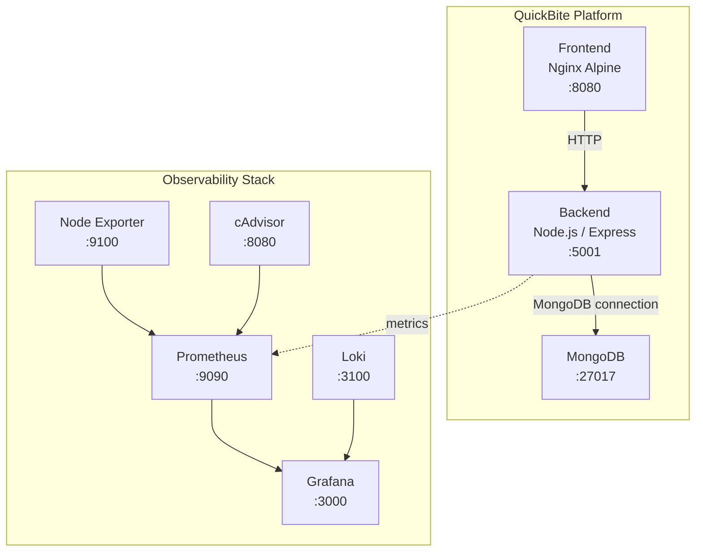
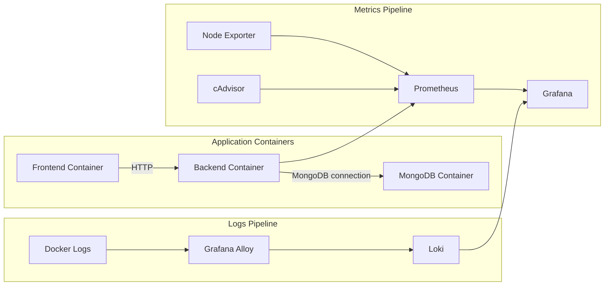
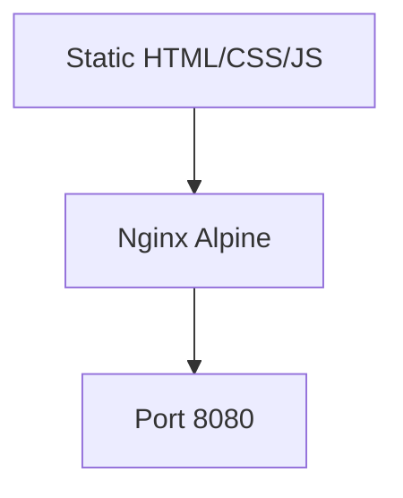
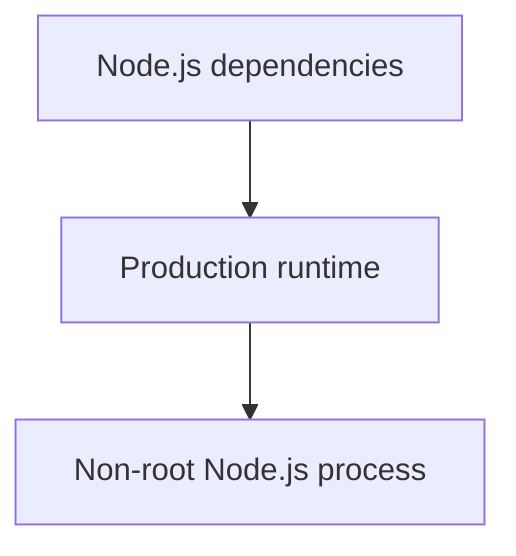
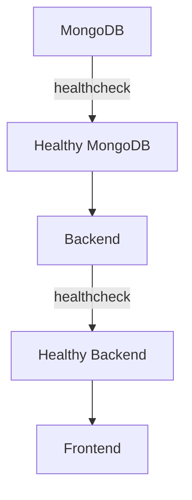
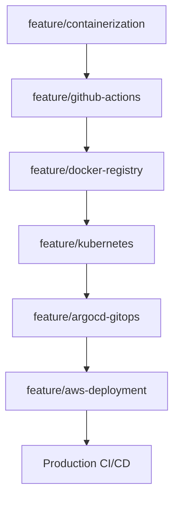
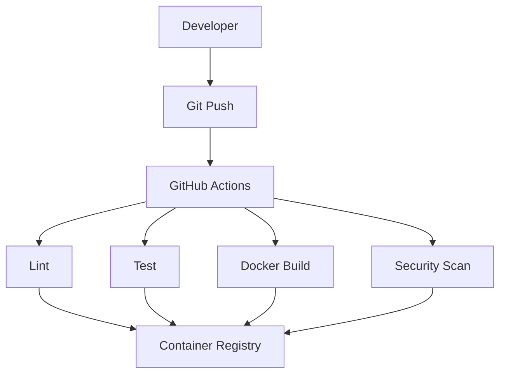
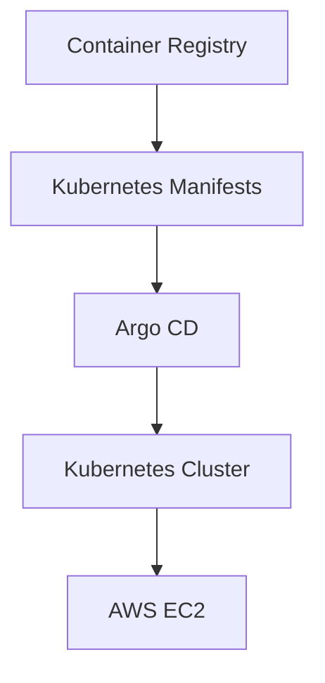
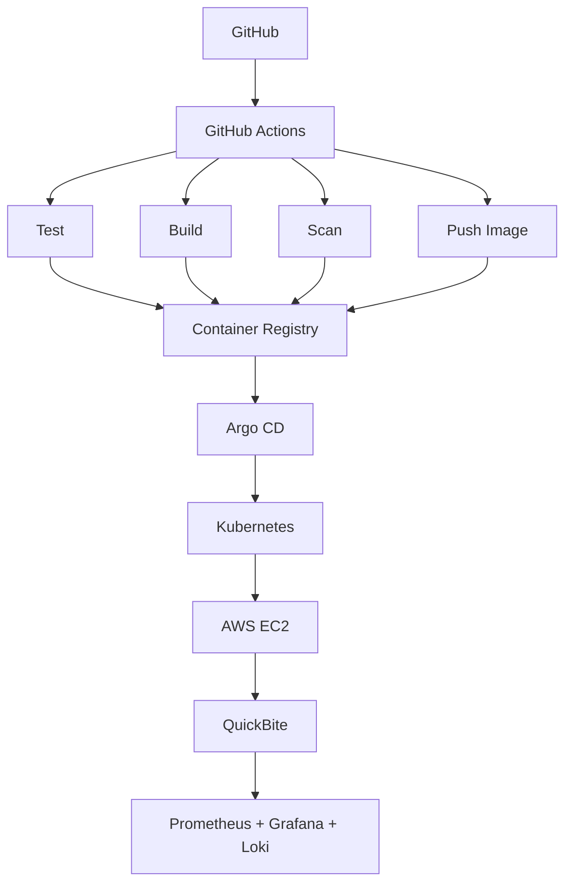

# QuickBite — Cloud-Native 3-Tier Food Ordering Platform

QuickBite is a production-oriented 3-tier food ordering application being enhanced with containerization, observability, Kubernetes, GitHub Actions CI/CD, GitOps with Argo CD, and AWS deployment.

> **Current branch:** `feature/containerization`
> This branch establishes the **Docker and Docker Compose** foundation for the project — application containers plus a full local observability stack.

---

## Table of Contents

- [Architecture](#architecture)
- [Technology Stack](#technology-stack)
- [Docker Architecture](#docker-architecture)
- [Container Images](#container-images)
- [Service Dependencies](#service-dependencies)
- [Health Checks](#health-checks)
- [Observability](#observability)
- [Docker Compose Usage](#docker-compose-usage)
- [Project Services](#project-services)
- [Persistent Data](#persistent-data)
- [Security Improvements](#security-improvements)
- [Planned CI/CD Evolution](#planned-cicd-evolution)
- [Development Roadmap](#development-roadmap)
- [Project Goal](#project-goal)
- [License](#license)

---

## Architecture


## Monitoring


## UI of Application


---

## Technology Stack

### Application

| Layer    | Technology                          |
| -------- | ------------------------------------ |
| Frontend | Static HTML / CSS / JavaScript       |
| Web tier | Nginx — static file server + reverse proxy |
| Backend  | Node.js / Express                    |
| Database | MongoDB                              |

### Containerization

- Docker
- Docker Compose
- Multi-stage Docker build for the backend
- Nginx unprivileged container
- Non-root application execution

### Observability

- Prometheus
- Grafana
- Node Exporter
- cAdvisor
- Grafana Loki
- Grafana Alloy

### Planned DevOps Platform

- GitHub Actions
- Kubernetes
- kind
- Argo CD
- AWS EC2
- Container Registry

---

## Docker Architecture

The application is split into independent containers, and the observability components run as a separate set of containers.



---

## Container Images

### Frontend

The frontend is a static website, so there is no Node.js build process. The production image uses an unprivileged Nginx image.



- **Dockerfile:** `Dockerfile.frontend`
- **Host access:** `http://localhost`
- **Docker port mapping:** `80:8080`

### UI


### Backend

The backend uses a multi-stage Docker build.



- **Dockerfile:** `Dockerfile.backend`
- **Listens on:** `5001`


### MongoDB

- Uses a persistent Docker volume: `mongodb_data`
- Includes a healthcheck to verify that MongoDB is accepting requests


---

## Service Dependencies

The application uses Docker Compose **health-based** dependencies, which is more reliable than depending only on container startup order.



- The **backend** waits for MongoDB to become healthy before starting.
- The **frontend** waits for the backend to become healthy before starting.

---

## Health Checks

### MongoDB

```bash
mongosh --eval 'db.adminCommand({ ping: 1 }).ok'
```

### Backend

```
GET /health
```

Expected response:

```json
{
  "status": "healthy"
}
```

The Docker healthcheck uses this endpoint to determine whether the backend is ready.

---

## Observability

### Loki 


### Grafana


### Prometheus


The current Compose environment includes:

| Component      | Purpose                                                      | Endpoint                 |
| --------------- | ------------------------------------------------------------- | ------------------------- |
| **Prometheus**   | Collects metrics from itself, Node Exporter, and cAdvisor    | http://localhost:9090     |
| **Grafana**      | Visualizes Prometheus metrics and Loki logs                  | http://localhost:3000     |
| **Node Exporter**| Host-level metrics: CPU, memory, disk, network, system stats | http://localhost:9100     |
| **cAdvisor**     | Container-level resource metrics                              | http://localhost:8080     |
| **Loki**         | Stores application/container logs                             | http://localhost:3100     |
| **Grafana Alloy**| Collects Docker/container logs and forwards them to Loki     | —                          |

---

## Docker Compose Usage

Start the complete stack:

```bash
docker compose up -d
```

Build the application images:

```bash
docker compose build
```

Rebuild without cache:

```bash
docker compose build --no-cache
```

View running services:

```bash
docker compose ps
```

View logs:

```bash
docker compose logs
```

View backend logs:

```bash
docker compose logs -f backend
```

View frontend logs:

```bash
docker compose logs -f frontend
```

View MongoDB logs:

```bash
docker compose logs -f mongodb
```

Stop the stack:

```bash
docker compose down
```

### Docker Running containers


Stop the stack and remove volumes:

```bash
docker compose down -v
```

> ⚠️ **Warning:** Removing volumes deletes the MongoDB and monitoring persistent data stored in Docker volumes.

---

## Project Services

| Service       | Container                | Port        |
| ------------- | ------------------------- | ----------- |
| Frontend      | `quickbite_frontend`      | 80          |
| Backend       | `quickbite_backend`       | 5001        |
| MongoDB       | `quickbite_db`            | 27017       |
| Prometheus    | `quickbite_prometheus`    | 9090        |
| Grafana       | `quickbite_grafana`       | 3000        |
| Node Exporter | `quickbite_node_exporter` | 9100        |
| cAdvisor      | `quickbite_cadvisor`      | 8080        |
| Loki          | `quickbite_loki`          | 3100        |
| Grafana Alloy | `quickbite_alloy`         | —           |

All application and monitoring containers communicate through the `quickbite_net` Docker network.

---

## Persistent Data

### DB


Docker volumes are used for stateful services:

- `mongodb_data`
- `prometheus_data`
- `grafana_data`
- `loki_data`

This allows application and monitoring data to survive container recreation.

---

## Security Improvements

- Non-root backend container
- Unprivileged Nginx frontend
- Production-only Node.js dependencies
- Multi-stage backend Docker build
- Persistent volumes for stateful services
- Docker healthchecks
- Service dependency conditions
- Isolated Docker network

---

## Planned CI/CD Evolution



### Planned CI Pipeline



### Planned CD Pipeline



---

## Development Roadmap

- [x] Dockerize backend
- [x] Dockerize static frontend
- [x] Add MongoDB healthcheck
- [x] Add backend healthcheck
- [x] Add Docker Compose service dependencies
- [x] Add Prometheus
- [x] Add Grafana
- [x] Add Node Exporter
- [x] Add cAdvisor
- [x] Add Loki
- [x] Add Grafana Alloy
- [ ] Improve Prometheus dashboards
- [ ] Add GitHub Actions CI
- [ ] Add container image scanning
- [ ] Push images to container registry
- [ ] Create Kubernetes manifests
- [ ] Deploy to kind
- [ ] Install and configure Argo CD
- [ ] Implement GitOps workflow
- [ ] Deploy Kubernetes environment on AWS EC2
- [ ] Implement complete CI/CD pipeline
- [ ] Add production monitoring and alerting

---

## Project Goal

The final objective is to transform QuickBite into a complete cloud-native DevOps project:



---

## License

This project follows the license and terms of the original repository.
